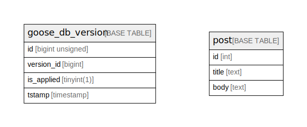

# sample

## Tables

| Name | Columns | Comment | Type |
| ---- | ------- | ------- | ---- |
| [goose_db_version](goose_db_version.md) | 4 |  | BASE TABLE |
| [post](post.md) | 3 | 投稿テーブル | BASE TABLE |

## Relations

---

> Generated by [tbls](https://github.com/k1LoW/tbls)
