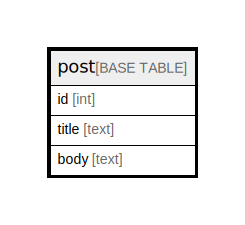

# post

## Description

投稿テーブル

<details>
<summary><strong>Table Definition</strong></summary>

```sql
CREATE TABLE `post` (
  `id` int NOT NULL COMMENT '投稿ID',
  `title` text COMMENT '投稿タイトル',
  `body` text COMMENT '投稿内容',
  PRIMARY KEY (`id`)
) ENGINE=InnoDB DEFAULT CHARSET=utf8mb4 COLLATE=utf8mb4_0900_ai_ci COMMENT='投稿テーブル'
```

</details>

## Columns

| Name  | Type | Default | Nullable | Children | Parents | Comment      |
| ----- | ---- | ------- | -------- | -------- | ------- | ------------ |
| id    | int  |         | false    |          |         | 投稿ID       |
| title | text |         | true     |          |         | 投稿タイトル |
| body  | text |         | true     |          |         | 投稿内容     |

## Constraints

| Name    | Type        | Definition       |
| ------- | ----------- | ---------------- |
| PRIMARY | PRIMARY KEY | PRIMARY KEY (id) |

## Indexes

| Name    | Definition                   |
| ------- | ---------------------------- |
| PRIMARY | PRIMARY KEY (id) USING BTREE |

## Relations



---

> Generated by [tbls](https://github.com/k1LoW/tbls)
